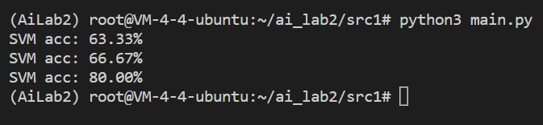
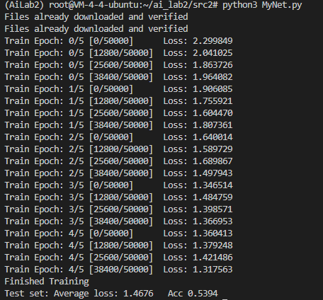

# 人工智能导论实验2
> PE20110007
> 伍少枫

## 实验概览
本次实验包含传统机器学习与深度学习两部分。传统机器学习包括决策树和SVM的实现，深度学习部分包括手写感知机模型并进行反向传播以及卷积神经网络的实现。 

## 1 决策树
### 1.1 整体代码结构
所有与决策树相关的方法函数都包含在类`DecisionTree`内，下面说明每个方法的作用：
```python
class DecisionTree:
    def __init__(self): 
       self.root = TreeNode(None,None) # a dummy root

    def fit(self, train_features, train_labels):
        '''
        TODO: 实现决策树学习算法.
        train_features是维度为(训练样本数,属性数)的numpy数组
        train_labels是维度为(训练样本数, )的numpy数组
        '''
        # ...

    def predict(self, test_features):
        '''
        TODO: 实现决策树预测.
        test_features是维度为(测试样本数,属性数)的numpy数组
        该函数需要返回预测标签，返回一个维度为(测试样本数, )的numpy数组
        '''
        # ...


    # PredictRecursive  recursive call for finding the label for a given sample
    # @ test_target     the index of testing sample in test_set
    # @ node            current dt node we are at   
    def PredictRecursive(self, test_features, test_target, node):
        # ...

    # FitRecursive      recursive call for decision tree learning
    # @train_set        numpy array that includes training set indexes
    # @available_features    numpy array that indicates wether an attribute has been used for splitting 
    # @parent_node      the node that calls this round of recursion(so "parent" node)          
    def FitRecursive(self, train_set, train_features, train_labels, available_features, parent_node):
        # ...

    # FindBestAttr      Find the best splitting attribute for current dataset based on information gain
    def FindBestAttr(self, train_set, train_features, train_labels, available_features):
        # ...
    
    # Helpers for calculating information gain
    # log               calculate value for log(base)(x)
    def log(self,base,x):
        #...

    # IG                calculate information gain when splitting train_set using attribute: attr_id
    # @ attr_id         id for the splitting attribute
    # @ train_set       the current training set 
    def IG(self, attr_id, train_set, train_features, train_labels):
        # ...
    # I                 calculate entropy for train_set    
    def I(self, attr_id, train_set, train_features, train_labels):
        # ...
    # Remainder         calculate conditional entropy that use attribute: attr_id to split
    def Remainder(self, attr_id, train_set, train_features, train_labels): 
        # ...
```
### 1.2 决策树训练算法
`DecisionTree`类中的`fit`方法用于训练得到决策树，`fit`方法调用`FitRecursive`方法进行递归的训练。`FitRecursive`方法代码如下。该方法可以分为三部分：
- Part1: 特殊情况检查（递归基础情况检查）：如果所有样本标签相同，那么生成对应标签的叶子节点；如果属性集为空或者所有样本在属性集上的取值完全相同，那么选取有更多样本的标签生成叶子节点。
- Part2：选取最优划分属性。最优属性的选取由`FindBestAttr`完成，将在下一节进行说明。
- Part3：使用最优属性进行划分。划分时对于属性某值形成的样本子集，如果为空集，按照训练集更多的标签生成叶子节点；如果不围空集，那么对训练集划分后进行递归调用。
```python
def FitRecursive(self, train_set, train_features, train_labels, available_features, parent_node):
        # Part1: check if recursion should end
        # note that train_set will never be empty since later we will check before recursive call

        # all labels same, the label is the result(don't forget to link the node)
        same_label_flag = 1
        first_label = train_labels[train_set[0]]
        for i in train_set:
            if train_labels[i] != first_label:
                same_label_flag = 0
                break
        if same_label_flag == 1:
            node = TreeNode(None,first_label)
            parent_node.children.append(node)
            return
        
        no_attr_flag = 0
        same_attr_value_flag = 1
        pcount = 0
        ncount = 0
        # no attr for select OR all data has same value for available attrs, select label with more data as result(don't forget to link the node)
        for i in train_set:
                if train_labels[i] == 0:
                    ncount = ncount + 1
                else:
                    pcount = pcount + 1

        if available_features.size == 0:
            no_attr_flag = 1
        else:
            for i in train_set:
                for j in available_features:
                    if train_features[i][j] != train_features[0][j]:
                        same_attr_value_flag = 0
                        break
                if same_attr_value_flag == 0:
                    break    
        
        if no_attr_flag==1 or same_attr_value_flag==1 :
            if pcount >= ncount:
                node = TreeNode(None,POSITIVE)
            else: 
                node = TreeNode(None,NEGATIVE)
            parent_node.children.append(node)
            return 

        # Part2: select best attr
        best_attr,best_index = self.FindBestAttr(train_set,train_features, train_labels,available_features)

        
        # Part3: for each value of attr, create a leaf or recursive call
        attr_count_buckets = np.zeros(ATTR_VALUE_NUM_MAX,dtype=int)
        attr_pcount_buckets = np.zeros(ATTR_VALUE_NUM_MAX,dtype=int)
        attr_ncount_buckets = np.zeros(ATTR_VALUE_NUM_MAX,dtype=int)
        for i in train_set:
            attr_value = train_features[i][best_attr]
            label = train_labels[i]
            attr_count_buckets[attr_value] = attr_count_buckets[attr_value]+1
            if label == POSITIVE:
                attr_pcount_buckets[attr_value] = attr_pcount_buckets[attr_value]+1
            else:
                attr_ncount_buckets[attr_value] = attr_ncount_buckets[attr_value]+1    

        value = 0
        current_node = TreeNode(best_attr,None)
        parent_node.children.append(current_node)    
        while value <= ATTR_VALUE_NUM_MAX-1:
        # no data in the split, select label with more data as the result(don't forget to link the node)
            if attr_count_buckets[value] == 0: 
                if attr_pcount_buckets[value] >= attr_ncount_buckets[value]:
                    label = POSITIVE
                else:
                    label = NEGATIVE
                leaf_node = TreeNode(best_attr,label)
                current_node.children.append(leaf_node)

        # recursive call
            else:
                split_list = []
                for i in train_set:
                    if train_features[i][best_attr] == value:
                        split_list.append(i)
                split_set = np.array(split_list)
                self.FitRecursive(split_set, train_features, train_labels, np.delete(available_features,best_index), current_node)
                
            value = value + 1
```

### 1.3 最优属性划分
最优属性划分由`FindBestAttr`完成，其函数逻辑如下。在寻找最优划分属性时，我们使用信息增益来确定最优属性。信息增益的计算可以参考课件，即熵与条件熵的差值。在`FindBestAttr`中，我们依次对可用的属性计算划分后的信息增益，并选择信息增益最大的属性。另外，要注意的是，`numpy`的`log`函数若自变量为0那么返回`-inf`，该值与0相乘会得到`nan`，因此要对频率为0的情况特殊考虑。
```python
def FindBestAttr(self, train_set, train_features, train_labels, available_features):
        # for each available attr, calculate IG. Select the one with highest IG
        if available_features.size == 0:
            return None,None
        ig_max = -np.inf
        attr_id_best = 0
        attr_index_best = 0
        i = 0
        while i < available_features.size:
            attr_id = available_features[i]
            ig = self.IG(attr_id, train_set, train_features, train_labels)
            if ig > ig_max:
                ig_max  = ig
                attr_id_best = attr_id
                attr_index_best = i
            i = i + 1
        return attr_id_best,attr_index_best
```

### 1.4 决策树构建
我们将决策树节点定义为一个类，具体形式如下：
```python
class TreeNode:
    def __init__(self, attr, label):
        self.children=[]
        self.attr = attr
        self.label = label
```
`children`列表存放子节点，由于在`FitRecursive`中，我们按顺序遍历属性对应的所有值，因此节点也是顺序加入该列表的。`attr`为当前节点对应判断属性的id。`label`为叶子节点对应的标签结果。
### 1.x 模型预测结果
使用`dataset/dt/dt_test.data`中的测试数据集对模型预测结果进行评估，模型在测试数据集上的预测准确率为58.93%（如下图）。


## 2 SVM
### 2.1 整体结构
上述函数中，SVM训练函数`fit`可以分为两部分：
- 构建`cvxpy`问题的目标函数、优化变量、约束条件等。
- 使用`cvxpy`求解器对问题进行求解。求解后只保存支持向量以及对应$\alpha$和标签。
`fit`函数的代码如下。
```python
def fit(self, train_data, train_label):
        # Part 1: Construct the problem
        m = len(train_label) # # of samples
        d = train_data.shape[1] # dim of samples
        x = train_data # training samples
        y = []
        for i in range(m):
            y.append([train_label[i]])
        y = np.array(y)
        alpha = cvx.Variable(shape=(m,1),pos=True) # lagrange multiplier
        #G = np.matmul(y*x, (y*x).T) # Gram matrix
        G = self.kernel_func(x)
        objective = cvx.Maximize(cvx.sum(alpha)-(1/2)*cvx.quad_form(alpha, y@y.T*G))
        constraints = [alpha <= self.C, cvx.sum(cvx.multiply(alpha,y)) == 0] # box constraint
        prob = cvx.Problem(objective, constraints)
        # Part 2: Solve the problem using a solver and process the result.
        result = prob.solve(verbose=False,solver=cvx.ECOS)
        
        i = 0
        a = alpha.value
        while i < a.size:
            if a[i][0] < self.epsilon:
                a[i][0] = 0
            else:
                self.SV.append(train_data[i])
                self.SV_alpha.append(a[i][0])
                self.SV_label.append(train_label[i])
            i = i + 1
```
上述函数中`predict`函数的标签预测过程为：使用训练得到的$\alpha$值重构$\omega$和$b$，然后使用公式$y_i = \omega x_i + b$对测试数据进行标签值计算，若小于0则标签为-1，否则为1。代码中重构$\omega$和$b$的方法为$\omega = \sum_i \alpha _i y_i x_i$以及$b = y_i - \omega ^T_i x_i$。
```python
def predict(self, test_data):
        predict_labels = []
        w = np.zeros(7,dtype = float)
        b = 0

        for i in range(len(self.SV)):
            w = w + self.SV_alpha[i] * self.SV_label[i] * self.SV[i]
        b = self.SV_label[0] - np.inner(w,self.SV[0])
        for i in test_data:
            predict_value = np.inner(w,i) + b
            if predict_value<0:
                predict_labels.append(-1)
            else:
                predict_labels.append(1)

        return predict_labels
```

### 2.2 QP问题构建
使用`cvxpy`进行求解首先需要对问题的目标函数、变量、约束条件进行描述。对于软间隔SVM的训练，我们的优化变量为拉格朗日乘子$\alpha$，其形式如下：
```python
alpha = cvx.Variable(shape=(m,1),pos=True) # lagrange multiplier
```
训练中目标函数如下，其中`G`为通过核函数计算得到的内积矩阵，对应项为`KERNEL(train_data[i],train_data[j])`。
```python
objective = cvx.Maximize(cvx.sum(alpha)-(1/2)*cvx.quad_form(alpha, y@y.T*G))
```
与内积矩阵获得相关的函数为`kernel_func`，其代码如下。其调用已实现的`KERNEL`来进行内积矩阵的生成。
```python
    def kernel_func(self, x , d=2, sigma=1):
        gram  = np.zeros(len(x)*len(x),dtype=float).reshape(len(x),len(x))
        for i in range(len(x)):
            for j in range(len(x)):
                gram[i][j] = self.KERNEL(x[i],x[j])
        return gram
```
训练中约束如下，对应软间隔SVM问题的约束。
```python
constraints = [alpha <= self.C, cvx.sum(cvx.multiply(alpha,y)) == 0] # box constraint
```
依靠上述目标函数、变量、约束条件构建的问题是原问题的对偶问题，对于SVM的原问题，可以通过求解对偶问题来进行求解。

另外，我们在问题求解过程中使用的`cvxpy`版本为1.1.13，未使用最新版本的原因是最新版本会检查优化问题是否为凸优化问题，但实际上即使问题是凸优化问题，不使用`cvxpy`自带的标准进行问题描述，仍然会带来错误。使用的求解器为`ECOS`，默认求解器对于`Poly`核函数会出现错误。
### 2.3 模型预测结果
我们使用`Linear`，`Gauss`和`Poly`核函数进行预测的准确度如下图。可以看到对于本实验的数据，预测准确率`Linear` < `Gauss` < `Poly`。


## 3
## 4 实现一个卷积神经网络
本部分主要阐述实验第四部分：实现卷积神经网络的代码结构、网络层次以及训练后模型的预测结果。
### 4.1 代码结构
依照实验要求，搭建模型2（07%6+1=2），对CIFAR10数据集进行训练并验证模型效果。

首先，对于模型2，其网络结构定义在`MyNet`类初始化函数内，对应代码如下。该部分代码定义了模型2网络的层次结构，其依次为2D卷积、最大池化、2D卷积、最大池化、线性层、线性层、线性层，其中在每个卷积层和线性层后均加入了relu激活函数提高网络性能，`nn.Flatten`函数用于改变张量维度，使得最终输出结果为大小为(128,10)的张量。
```python
def __init__(self):
        super(MyNet,self).__init__()
        ########################################################################
        #这里需要写MyNet的卷积层、池化层和全连接层
        # Model 2
        self.model = nn.Sequential(
            nn.Conv2d(3, 24, 9),
            nn.ReLU(),
            nn.MaxPool2d(2),
            nn.Conv2d(24, 32, 3),
            nn.ReLU(),
            nn.MaxPool2d(2),
            nn.Flatten(),
            nn.Linear(800, 108),
            nn.ReLU(),
            nn.Linear(108, 72),
            nn.ReLU(),
            nn.Linear(72, 10),
            nn.ReLU(),
        )
```
在定义好网络所包含的层次后，向前传播函数定义如下。由于模型层次定义时使用了`nn.Sequential`，因此只需要调用该定义即可。
```python
    def forward(self, x):
        ########################################################################
        #这里需要写MyNet的前向传播
        x = self.model(x)
        return x 
```
网络训练函数中需要完成向前传播的代码，这部分代码如下。首先清空优化器梯度，然后将这一轮训练的数据输入网络，得到网络给出的预测值，然后计算损失并进行反向传播。
```python
            ...
            ########################################################################
            #计算loss并进行反向传播
            optimizer.zero_grad()
            y_pred = net(inputs)
            loss = loss_function(y_pred, labels)
            loss.backward()
            optimizer.step()
            ########################################################################
            ...
```
上述代码中，`loss_function`和`optimizer`分别使用`nn.CrossEntropyLoss()`和`torch.optim.Adam(net.parameters(),lr = learning_rate)`，来对这一标签分类问题（结果只有一个标签）进行预测。

最后，对于测试集的预测，对应函数为`test()`，其中计算loss以及accuracy的代码如下。对测试集数据进行预测的算法很简单，将测试集数据输入模型，对比预测结果与实际结果，计算损失值以及准确度即可。
```python
...
    with torch.no_grad():
            for inputs, labels in test_loader:
                inputs, labels = inputs.to(device), labels.to(device)
            ########################################################################
            #需要计算测试集的loss和accuracy
                y_pred = net(inputs)
                pred = y_pred.argmax(dim=1)
                num_correct += (pred == labels).sum()

            accuracy = int(num_correct)/len(test_loader.dataset)
            test_loss = loss_function(y_pred, labels.to(device, torch.long))
            ########################################################################
```
### 4.2 预测结果
模型经过5个epochs的训练后，其对于CIFAR10数据集测试集的标签预测准确度为52.22%，说明了模型2对应卷积神经网络经过训练后具有了对该数据集的一定的预测能力。另外，我们还尝试了进行更多epochs的训练，但从训练过程的输出来看，实际上5个epochs后，损失值接近收敛，最终预测结果没有明显提升。如果想要提高预测准确度，可以考虑修改模型的层次结构。

