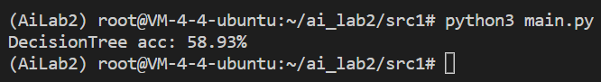

# 人工智能导论实验2
> PE20110007
> 伍少枫

## 实验概览
本次实验包含传统机器学习与深度学习两部分。传统机器学习包括决策树和SVM的实现，深度学习部分包括手写感知机模型并进行反向传播以及卷积神经网络的实现。 

## 1 决策树
### 1.x 整体代码结构
所有与决策树相关的方法函数都包含在类`DecisionTree`内，下面说明每个方法的作用：
```python
class DecisionTree:
    def __init__(self): 
       self.root = TreeNode(None,None) # a dummy root

    def fit(self, train_features, train_labels):
        '''
        TODO: 实现决策树学习算法.
        train_features是维度为(训练样本数,属性数)的numpy数组
        train_labels是维度为(训练样本数, )的numpy数组
        '''
        # ...

    def predict(self, test_features):
        '''
        TODO: 实现决策树预测.
        test_features是维度为(测试样本数,属性数)的numpy数组
        该函数需要返回预测标签，返回一个维度为(测试样本数, )的numpy数组
        '''
        # ...


    # PredictRecursive  recursive call for finding the label for a given sample
    # @ test_target     the index of testing sample in test_set
    # @ node            current dt node we are at   
    def PredictRecursive(self, test_features, test_target, node):
        # ...

    # FitRecursive      recursive call for decision tree learning
    # @train_set        numpy array that includes training set indexes
    # @available_features    numpy array that indicates wether an attribute has been used for splitting 
    # @parent_node      the node that calls this round of recursion(so "parent" node)          
    def FitRecursive(self, train_set, train_features, train_labels, available_features, parent_node):
        # ...

    # FindBestAttr      Find the best splitting attribute for current dataset based on information gain
    def FindBestAttr(self, train_set, train_features, train_labels, available_features):
        # ...
    
    # Helpers for calculating information gain
    # log               calculate value for log(base)(x)
    def log(self,base,x):
        #...

    # IG                calculate information gain when splitting train_set using attribute: attr_id
    # @ attr_id         id for the splitting attribute
    # @ train_set       the current training set 
    def IG(self, attr_id, train_set, train_features, train_labels):
        # ...
    # I                 calculate entropy for train_set    
    def I(self, attr_id, train_set, train_features, train_labels):
        # ...
    # Remainder         calculate conditional entropy that use attribute: attr_id to split
    def Remainder(self, attr_id, train_set, train_features, train_labels): 
        # ...
```
### 1.x 决策树训练算法
`DecisionTree`类中的`fit`方法用于训练得到决策树，`fit`方法调用`FitRecursive`方法进行递归的训练。`FitRecursive`方法代码如下。该方法可以分为三部分：
- Part1: 特殊情况检查（递归基础情况检查）：如果所有样本标签相同，那么生成对应标签的叶子节点；如果属性集为空或者所有样本在属性集上的取值完全相同，那么选取有更多样本的标签生成叶子节点。
- Part2：选取最优划分属性。最优属性的选取由`FindBestAttr`完成，将在下一节进行说明。
- Part3：使用最优属性进行划分。划分时对于属性某值形成的样本子集，如果为空集，按照训练集更多的标签生成叶子节点；如果不围空集，那么对训练集划分后进行递归调用。
```python
def FitRecursive(self, train_set, train_features, train_labels, available_features, parent_node):
        # Part1: check if recursion should end
        # note that train_set will never be empty since later we will check before recursive call

        # all labels same, the label is the result(don't forget to link the node)
        same_label_flag = 1
        first_label = train_labels[train_set[0]]
        for i in train_set:
            if train_labels[i] != first_label:
                same_label_flag = 0
                break
        if same_label_flag == 1:
            node = TreeNode(None,first_label)
            parent_node.children.append(node)
            return
        
        no_attr_flag = 0
        same_attr_value_flag = 1
        pcount = 0
        ncount = 0
        # no attr for select OR all data has same value for available attrs, select label with more data as result(don't forget to link the node)
        for i in train_set:
                if train_labels[i] == 0:
                    ncount = ncount + 1
                else:
                    pcount = pcount + 1

        if available_features.size == 0:
            no_attr_flag = 1
        else:
            for i in train_set:
                for j in available_features:
                    if train_features[i][j] != train_features[0][j]:
                        same_attr_value_flag = 0
                        break
                if same_attr_value_flag == 0:
                    break    
        
        if no_attr_flag==1 or same_attr_value_flag==1 :
            if pcount >= ncount:
                node = TreeNode(None,POSITIVE)
            else: 
                node = TreeNode(None,NEGATIVE)
            parent_node.children.append(node)
            return 

        # Part2: select best attr
        best_attr,best_index = self.FindBestAttr(train_set,train_features, train_labels,available_features)

        
        # Part3: for each value of attr, create a leaf or recursive call
        attr_count_buckets = np.zeros(ATTR_VALUE_NUM_MAX,dtype=int)
        attr_pcount_buckets = np.zeros(ATTR_VALUE_NUM_MAX,dtype=int)
        attr_ncount_buckets = np.zeros(ATTR_VALUE_NUM_MAX,dtype=int)
        for i in train_set:
            attr_value = train_features[i][best_attr]
            label = train_labels[i]
            attr_count_buckets[attr_value] = attr_count_buckets[attr_value]+1
            if label == POSITIVE:
                attr_pcount_buckets[attr_value] = attr_pcount_buckets[attr_value]+1
            else:
                attr_ncount_buckets[attr_value] = attr_ncount_buckets[attr_value]+1    

        value = 0
        current_node = TreeNode(best_attr,None)
        parent_node.children.append(current_node)    
        while value <= ATTR_VALUE_NUM_MAX-1:
        # no data in the split, select label with more data as the result(don't forget to link the node)
            if attr_count_buckets[value] == 0: 
                if attr_pcount_buckets[value] >= attr_ncount_buckets[value]:
                    label = POSITIVE
                else:
                    label = NEGATIVE
                leaf_node = TreeNode(best_attr,label)
                current_node.children.append(leaf_node)

        # recursive call
            else:
                split_list = []
                for i in train_set:
                    if train_features[i][best_attr] == value:
                        split_list.append(i)
                split_set = np.array(split_list)
                self.FitRecursive(split_set, train_features, train_labels, np.delete(available_features,best_index), current_node)
                
            value = value + 1
```

### 1.x 最优属性划分
最优属性划分由`FindBestAttr`完成，其函数逻辑如下。在寻找最优划分属性时，我们使用信息增益来确定最优属性。信息增益的计算可以参考课件，即熵与条件熵的差值。在`FindBestAttr`中，我们依次对可用的属性计算划分后的信息增益，并选择信息增益最大的属性。另外，要注意的是，`numpy`的`log`函数若自变量为0那么返回`-inf`，该值与0相乘会得到`nan`，因此要对频率为0的情况特殊考虑。
```python
def FindBestAttr(self, train_set, train_features, train_labels, available_features):
        # for each available attr, calculate IG. Select the one with highest IG
        if available_features.size == 0:
            return None,None
        ig_max = -np.inf
        attr_id_best = 0
        attr_index_best = 0
        i = 0
        while i < available_features.size:
            attr_id = available_features[i]
            ig = self.IG(attr_id, train_set, train_features, train_labels)
            if ig > ig_max:
                ig_max  = ig
                attr_id_best = attr_id
                attr_index_best = i
            i = i + 1
        return attr_id_best,attr_index_best
```

### 1.x 决策树构建
我们将决策树节点定义为一个类，具体形式如下：
```python
class TreeNode:
    def __init__(self, attr, label):
        self.children=[]
        self.attr = attr
        self.label = label
```
`children`列表存放子节点，由于在`FitRecursive`中，我们按顺序遍历属性对应的所有值，因此节点也是顺序加入该列表的。`attr`为当前节点对应判断属性的id。`label`为叶子节点对应的标签结果。
### 1.x 模型预测结果
使用`dataset/dt/dt_test.data`中的测试数据集对模型预测结果进行评估，模型在测试数据集上的预测准确率为58.93%（如下图）。
